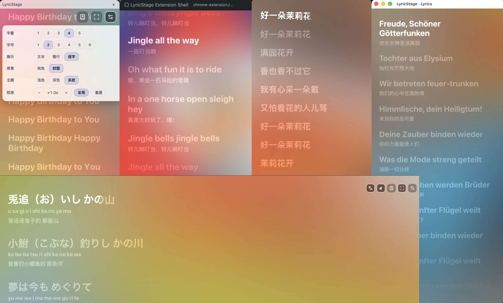

# LyricStage

基于 Web Animations API 与 Shadow DOM 的跨站同步歌词播放器与歌词渲染引擎（Chrome 浏览器扩展）。

---

## 📸 截图



---

## 🌐 支持平台

- **网易云音乐 Web** (`music.163.com`)
- **QQ 音乐 Web** (`y.qq.com`)
- **Apple Music Web** (`music.apple.com`)
- **YouTube** (`youtube.com`)
- **Bilibili** (`bilibili.com`)

---

## 📖 安装指南

1. 在 GitHub Releases 中下载最新的 `LyricStage-Extension-v*.zip` 并解压（或下载源码自行构建）。
2. 打开 Chrome 浏览器，访问 `chrome://extensions/`。
3. 开启右上角 **“开发者模式” (Developer mode)**。
4. 点击 **“加载已解压的扩展程序” (Load unpacked)**，选择解压出的 `dist` 目录（或源码构建产物 `apps/extension/dist`）。

---

## 🚀 项目架构与模块说明

- `apps/extension`: Chrome 浏览器扩展应用 (LyricStage Extension)
- `packages/player`: 无框架依赖的纯 TypeScript 歌词播放器核心引擎 (Shadow DOM, WAAPI 动画, Karaoke 扫亮, CJK/Latin 动效)
- `packages/playback-core`: 播放时钟与状态调度核心
- `packages/platform-adapters`: 音乐/视频平台适配层
- `packages/storage`: 本地 IndexedDB 存储模块
- `packages/diagnostics`: 性能与渲染诊断工具
- `packages/extension-protocol`: 扩展消息通讯协议

---

## 💻 开发与构建

```bash
# 1. 安装依赖
pnpm install

# 2. 构建核心包与 Chrome 扩展应用
pnpm build
```

---

## 🥇 奖项


---

## 📜 许可证

- `packages/*`: MIT © 2026 oftx
- `apps/extension`: GPLv3 © 2026 oftx
